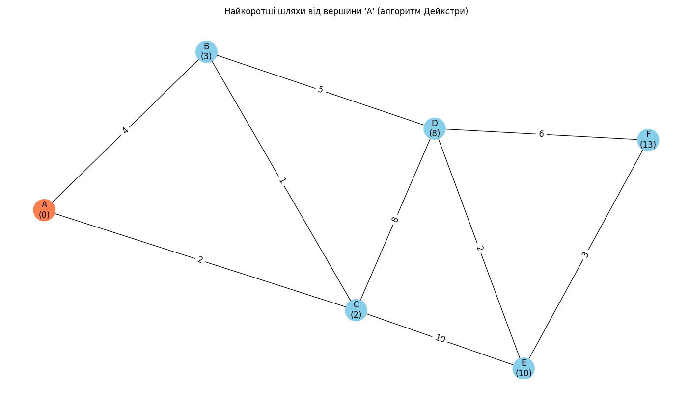
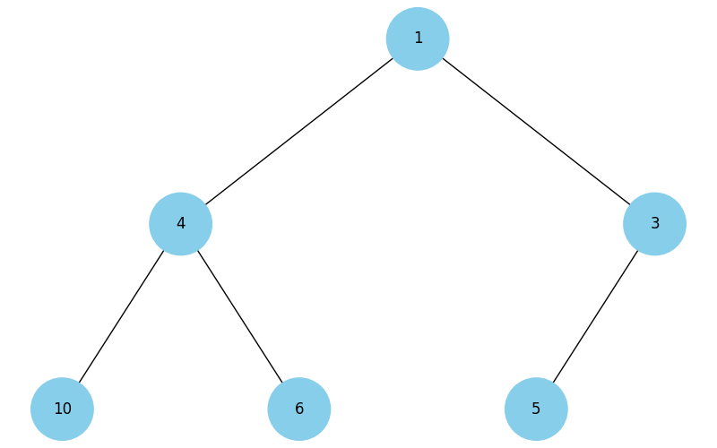
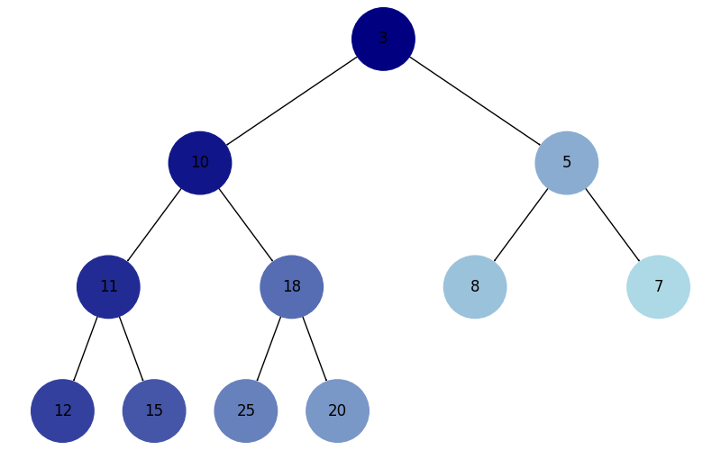
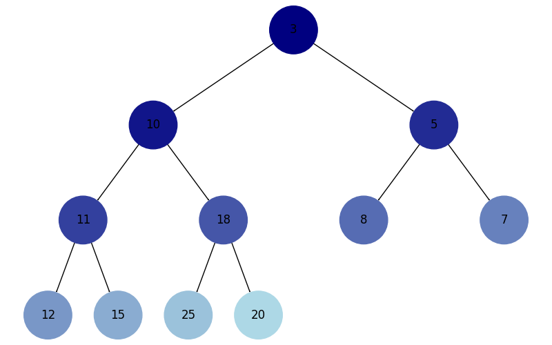
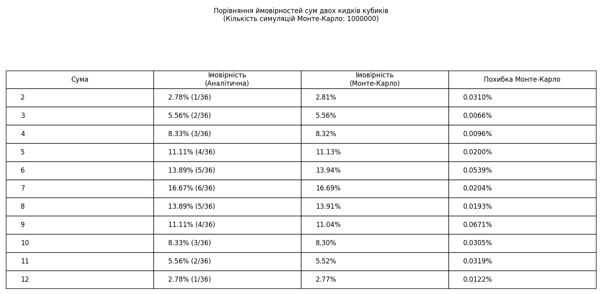

# goit-algo-fp

## Встановлення

Всередині проекту створіть віртуальне середовище:

```bash
python -m venv venv
```

активуйте віртуальне середовище:

```bash
# Windows
venv\Scripts\activate
```

```bash
# macOS/Linux
source venv/bin/activate
```

та встановіть залежності:

```bash
pip install -r requirements.txt
```

## Завдання 1: Структури даних. Сортування. Робота з однозв'язним списком

### Як запустити

```bash
python task1.py
```

### Результат

```
First Linked List:
[40, 35, 45, 25, 10, 15, 20, 5, 30]

Second Linked List:
[8, 12, 18, 22]

Merged and Sorted Linked List:
[5, 8, 10, 12, 15, 18, 20, 22, 25, 30, 35, 40, 45]

The same list but reversed:
[45, 40, 35, 30, 25, 22, 20, 18, 15, 12, 10, 8, 5]
```

## Завдання 2: Рекурсія. Створення фрактала “дерево Піфагора” за допомогою рекурсії

### Як запустити

```bash
python task2.py [рівень_рекурсії]
```

Якщо рівень рекурсії не вказано, то використовується рівень за замовчуванням: 8

### Результат


## Завдання 3: Дерева, алгоритм Дейкстри

### Як запустити

```bash
python task3.py
```

### Результат

```
Shortest paths from node 'A': {'A': 0, 'B': 3, 'C': 2, 'D': 8, 'E': 10, 'F': 13}
```



## Завдання 4: Візуалізація піраміди

### Як запустити

```bash
python task4.py
```

### Результат



## Завдання 5: Візуалізація обходу бінарного дерева

### Як запустити

```bash
python task5.py
```

### Результат




## Завдання 6: Жадібні алгоритми та динамічне програмування

### Як запустити

```bash
python task6.py
```

### Результат

```
Items:
 - pizza: cost=50, calories=300
 - hamburger: cost=40, calories=250
 - hot-dog: cost=30, calories=200
 - pepsi: cost=10, calories=100
 - cola: cost=15, calories=220
 - potato: cost=25, calories=350

Budget: 100

Greedy Algorithm Result:
Selected Items: cola, potato, pepsi, hot-dog
Total Cost: 80
Total Calories: 870

Dynamic Programming Result:
Selected Items: potato, cola, pepsi, pizza
Total Cost: 100
Total Calories: 970
```

## Завдання 7. Використання методу Монте-Карло

### Як запустити

```bash
python task7.py
```

### Результат



### Висновки

Метод Монте-Карло показав високу точність при моделюванні ймовірностей кидання двох кубиків. При 1000000 симуляцій похибка тримається десь на 0.00 до 0.06 відсотки у порівнянні з аналітичними розрахунками.

Збільшення кількості симуляцій дозволяє отримати більш точні результати, які майже збігаються з теоретичними ймовірностями. Однак це є й обмеженням, оскільки зростає час виконання програми. Ще одним обмеженням є випадковий характер методу, що може призводити до незначних відмінностей у результатах при кожному запуску.

Загалом, метод Монте-Карло є ефективним інструментом для моделювання випадкових процесів та обчислення ймовірностей, особливо у випадках, коли аналітичні методи є складними або непридатними.
